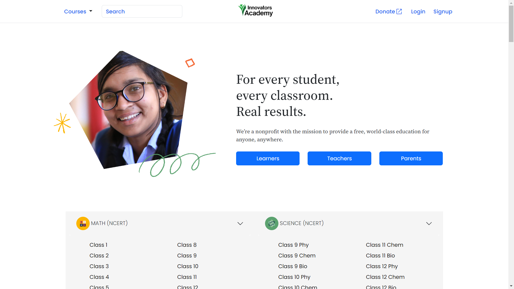
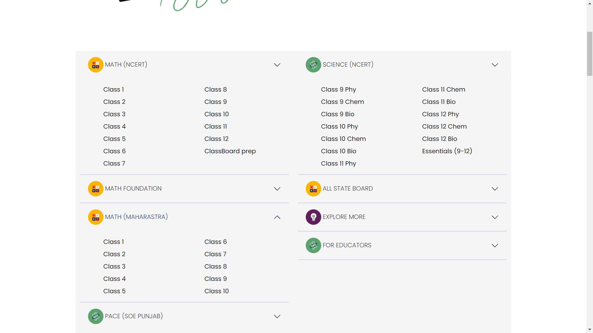
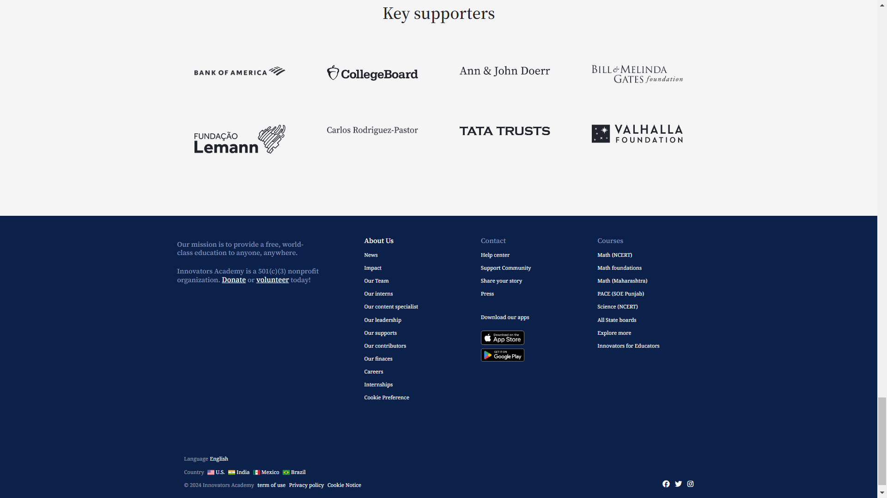

# Kaveri-Debugging-005

# Team Members

- [@Deepak Maurya](https://github.com/deep-maurya)
- [Mohd Saiful Islam](https://github.com/sislam824)
- [@Ayush Kumar](https://github.com/Ayush243871)
- [@Vishnu Sinha](https://github.com/VishnuSinha7600)
- [@Abhishek Gupta ](https://github.com/abhigupta3985)

## Table of Contents

- [About](#about)
- [Getting Started](#getting-started)
- [Usage](#usage)
- [Technologies Used](#technologies-used)
- [Deployment](#deployment)
- [Contributing](#contributing)
- [License](#license)

## About

"Anyone can learn anything. For free."
Khan Academy is Non-profit Orginaztion, Khan academy try to provide a free, world-class education to anyone, anywhere. Khan Academy offers practice exercises, instructional videos, and a personalized learning dashboard that empower learners to study at their own pace in and outside of the classroom. this academy tackle math, science, computing, history, art history, economics, and more, including K-14 and test preparation (SAT, Praxis, LSAT) content. this academy focus on skill mastery to help learners establish strong foundations, so there's no limit to what they can learn next!.

## Screenshots

## Deployment

Deployed Link(Bootstap Project):-https://innovatoracademy.netlify.app/
Deployed Link(Figma Project):-https://figmakaveridebugging.netlify.app/

## Getting Started

# Clone the repository

git clone https:https://github.com/deep-maurya/Kaveri-Debugging-005

# Change directory

cd your-repo

# Install dependencies

npm install

# Start the development server

npm start

## Technologies Used

Flyweis_technologies Application is built using the following technologies:

- Html
- CSS
- Bootsrap
- SCSS

## Usage

- Visit the application in your web browser at http://localhost:3000 or the URL https://innovatoracademy.netlify.app/ & https://figmakaveridebugging.netlify.app/
